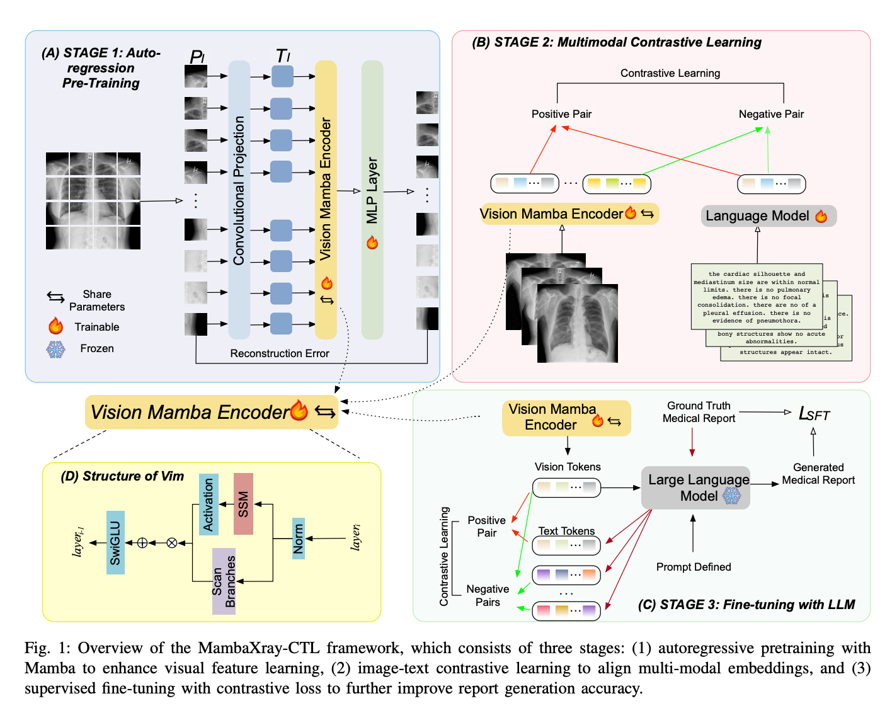

# MambaXray-CTL

Official implementation of **MambaXray-CTL: Multi-Stage Contrastive Training for Medical Report Generation with a Mamba-Based Multi-Modal Large Model**.

- [IEEE Xplore](https://ieeexplore.ieee.org/document/11343574)
- DOI: [10.1109/SMC58881.2025.11343574](https://doi.org/10.1109/SMC58881.2025.11343574)



The training pipeline contains three stages: autoregressive visual pretraining, image-report contrastive learning, and report-generation fine-tuning with an additional contrastive objective.

## Environment

The code requires Python 3.10, an NVIDIA GPU, and a CUDA toolchain compatible with PyTorch and `mamba-ssm`. The verified server environment is `vmamba3.10` with the versions recorded in `requirements.txt`.

```bash
conda create -n mambaxrayctl python=3.10 -y
conda activate mambaxrayctl
pip install -r requirements.txt
```

If PyTorch or `mamba-ssm` cannot be installed directly, install builds compatible with the CUDA version on the target machine, then install the remaining requirements.

## Paths

Dataset paths, local language models, image processors, and stage checkpoints are configured outside the Python code:

```bash
cp .env.example launch/paths.env
# Edit launch/paths.env with the paths on the current machine.
python scripts/doctor.py
```

Set `STAGE2_VISION_MODEL` to the stage-1 checkpoint and `STAGE3_VISION_MODEL` to the stage-2 checkpoint. A different path file can be selected with `MAMBA_XRAY_PATHS_FILE`.

## Training

Run all commands from the project root.

Stage 1 - autoregressive visual pretraining:

```bash
bash pretrain/pretrain.sh
```

Stage 2 - image-report contrastive learning on IU X-Ray:

```bash
bash launch/train_stage2_iu.sh
```

Stage 3 - report-generation fine-tuning:

```bash
bash launch/train_stage3_iu.sh
bash launch/train_stage3_chexpert.sh
```

The launchers load their defaults from `configs/profiles/`. Additional command-line options override the profile, for example:

```bash
bash launch/train_stage3_iu.sh --devices 1 --batch_size 4
```

## Evaluation

```bash
bash launch/evaluate.sh \
  configs/profiles/iu_xray_stage3.yaml \
  /path/to/stage3_checkpoint.pth
```

Evaluation generates reports and computes BLEU-1 to BLEU-4, ROUGE-L, and CIDEr. Training outputs are written to the `savedmodel_path` defined by the selected profile; stage-1 outputs default to `pretrain/outputs/test/`.

## Citation

```bibtex
@inproceedings{feng2025mambaxrayctl,
  title     = {MambaXray-CTL: Multi-Stage Contrastive Training for Medical Report Generation with a Mamba-Based Multi-Modal Large Model},
  author    = {Feng, Wenbin and Lu, Yu and Li, Xiaoqing and Shi, Shijie and Qi, Yingjian},
  booktitle = {2025 IEEE International Conference on Systems, Man, and Cybernetics (SMC)},
  year      = {2025},
  doi       = {10.1109/SMC58881.2025.11343574}
}
```
